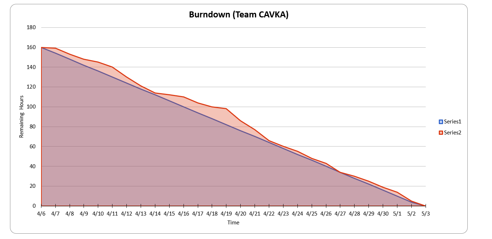
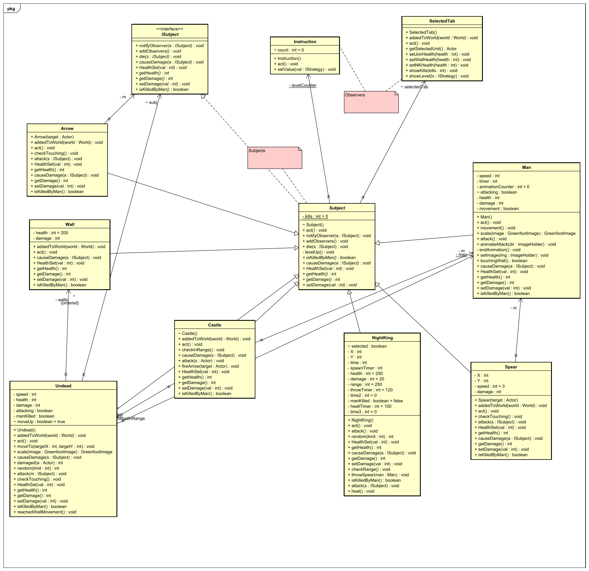

# Team Project Repo 

## Team Name
><b>CAVKA</b>
## Team Members
    [Arun] https://github.com/ArunKarthik2197
    [Vignesh] https://github.com/vignesht96
    [Kavya] https://github.com/kavyadayanand
    [Abhilash] https://github.com/

* [https://github.com/ArunKarthik2197](url_to_your_github_repo)
* [https://github.com/abhilashvadanala](url_to_your_github_repo)
* [https://github.com/vignesht96](url_to_your_github_repo)
* [https://github.com/kavyadayanand](url_to_your_github_repo)

## Project Name
><b>Winter is Here</b>
## Project Description
> - A <b>GOT</b> themed game in which the player must defend the castle(realm). 
> - When the night king is destroyed the game ends. 
> - Night king swarmed winterfell with an army of undead. Your people lost their morale. 
> - You must stand between the merciless undead and your realm. 
> - You'll get help along the way as you slay the undead and the morale of your soldiers is raised. 
> - With the help of your people kill the Night King and end the long night.
## Project Progress
>Assets gathered, the images and various other animations. 
>Implemented the observer pattern for unit selection. 
>Laid down the basic environment of the world. 

> -   Assets gathered, the images and various other animations. 
> -   6 patterns added, state,observer,strategy, factory, memento and visitor.  
> -   Game functionality laid out  
> -   All visual components added. 
> -   Yet to test the memento pattern. 
> -   Minor Glitches to be fixed.
> -   Use cases implemented.

### Burndown Map
#### Burndown till week-1
></img>
 #### Burndown till week-2
> </img>
#### Burndown till week-3
> </img>
#### Burndown till week-4
> </img>

### Project Dashboard

### Individual Contributions
#### Arun Karthik
> - Core functionality of the game, including hero's functionality,Undead, world layout etc., 
> - Added the observer pattern for healthbars of the wall, player and night king. 
> - fine tuning and gathering of assets. 
<b>Observer for game stats </b>
</img> 

#### Abhilash

#### Vignesh

#### Kavya

**Weekly Scrum Report:
Week 4: 28/4 - 4/5:

**####What tasks did I work on / complete?

Implemented visitor pattern to collate health of players and provide player with the feedback on damage.
Code Clean up
Bug Fixes:
Health in the visitor pattern was not updating properly for the undead class.
Memento pattern was giving a null pointer exception as the World object was not properly passed. 

**####XP value Feedback:**
Suggestions on code clean-up.

**####What am I planning to work on next?
None

**####What tasks are blocked waiting on another team member?
None

**###Week 3: 21/04 - 27/04:

**####What tasks did I work on / complete?**
Researched on design patterns that provides a way for object restoration to restore users previous checkpoint.
Implemented memento pattern to provide users a way to restore form the last checkpoint.

**####XP value Feedback:
Proposed changes of few technical stories to enable additional user stories implementation.

**####What am I planning to work on next?
Bugs and code smell fixes 
Sequence diagrams

**####What tasks are blocked waiting on another team member?
None

**###Week 2: 14/4 - 20/4:

**####What tasks did I work on / complete?**

Found that Tetris game could not be efficiently implemented on greenfoot.
Researched on various other games and came up with a game inspired by TV series Game of Thrones(GOT).
Performed analysis on the GOT game and features that can be implemented on greenfoot.
Had a brainstorming session with the team to come up with below
Features to be implemented 
User stories
Breakdown of user stories into tasks
Task allocation
Researched on design patterns that can potentially be used for the features in the project
Design Discussion with the team to come up with a high-level architecture of the project.
Implemented factory pattern to spawn players.
Asset collection for title screen and night king.

**###XP value Feedback:**
Provided feedback on architecture and user stories for the new game that needed to be implemented on priority to ensure timely completion of tasks.

**####What am I planning to work on next?**
Implement the story of player being able restore from a check point so that they can progress in the game.

**####What tasks are blocked waiting on another team member?**
None

**###Week 1: 6/4 - 13/4:

**####What tasks did I work on / complete?**
Worked with the team to compare various platforms such as D3.js, greenfoot for the game development.
Worked with team to research on unique and interesting games that can potentially be developed on greenfoot
Initially, came up with Tetris as a game that can be implemented on greenfoot
Performed analysis on Tetris and features that can be implemented on greenfoot.
Had a brainstorming session with the team to come up with below
Features to be implemented for Tetris
User stories
Breakdown of user stories into tasks
Task allocation
Researched on design patterns that can potentially be used for the various features in the project
Design Discussion with the team to come up with a high-level architecture of the project

**###XP value Communication:**
Discussed with teamamtes about :
To complete baseline features of the project first to enable base features.
Implement novel design patterns of the project for the WOW factor.

**####What am I planning to work on next?**
Derive use case specification from the user stories
Draw UML Diagrams to define micro architecture of the features at hand.

**####What tasks are blocked waiting on another team member?**
None.

