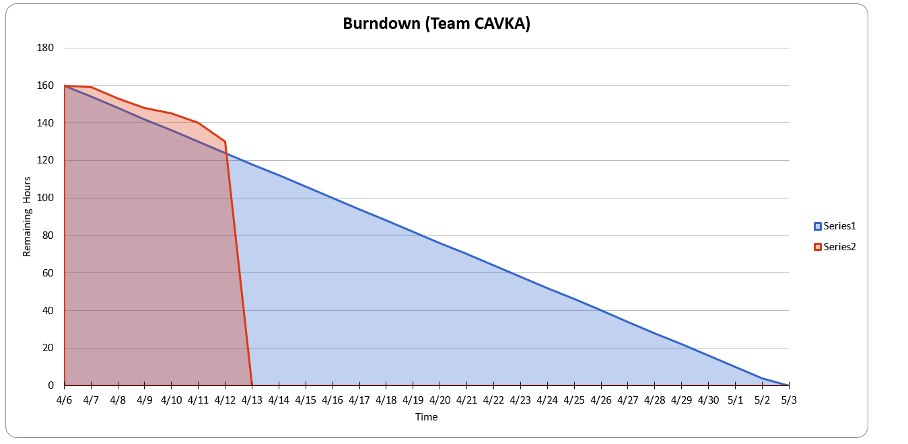
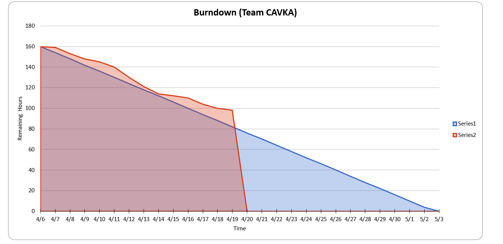
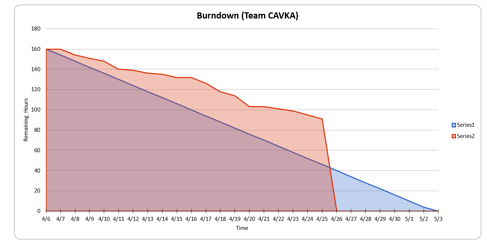

# Team Project Repo 

## Team Name
><b>CAVKA</b>
## Team Members

* [https://github.com/ArunKarthik2197](url_to_your_github_repo)
* [https://github.com/abhilashvadanala](url_to_your_github_repo)
* [https://github.com/vignesht96](url_to_your_github_repo)
* [https://github.com/kavyadayanand](url_to_your_github_repo)

## Project Name
><b>Winter is Here</b>
## Project Description
> - A <b>GOT</b> themed game in which the player must defend the castle(realm). 
> - When the night king is destroyed the game ends. 
> - Night king swarmed winterfell with an army of undead. Your people lost their morale. 
> - You must stand between the merciless undead and your realm. 
> - You'll get help along the way as you slay the undead and the morale of your soldiers is raised. 
> - With the help of your people kill the Night King and end the long night.
## Project Progress
> - Assets gathered, the images and various other animations. 
> - Implemented the observer pattern for unit selection. 
> - Laid down the basic environment of the world. 
> - Health bar observer and core game functionality added.
> - Yet to add levels.

### Burndown Map
#### Burndown till week-1
></img>
 #### Burndown till week-2
> </img>
#### Burndown till week-3
> </img>

### Project Dashboard

### Individual Contributions
#### Arun Karthik
> - Core functionality of the game, including hero's functionality,Undead, world layout etc., 
> - Added the observer pattern for healthbars of the wall, player and night king. 
> - fine tuning and gathering of assets. 

