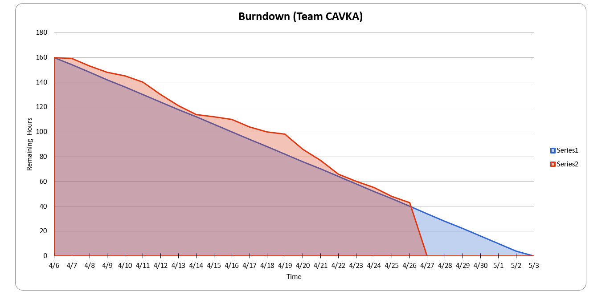

# Team Project Repo 

## Team Name
><b>CAVKA</b>
## Team Members
    [Arun] (https://github.com/ArunKarthik2197)
    [Vignesh] https://github.com/vignesht96
    [Kavya] https://github.com/kavyadayanand
    [Abhilash] https://github.com/

* [ArunKarthik2197](https://github.com/ArunKarthik2197)
* [https://github.com/abhilashvadanala](url_to_your_github_repo)
* [https://github.com/vignesht96](url_to_your_github_repo)
* [https://github.com/kavyadayanand](url_to_your_github_repo)

## Project Name
><b>Winter is Here</b>
## Project Description
> - A <b>GOT</b> themed game in which the player must defend the castle(realm). 
> - When the night king is destroyed the game ends. 
> - Night king swarmed winterfell with an army of undead. Your people lost their morale. 
> - You must stand between the merciless undead and your realm. 
> - You'll get help along the way as you slay the undead and the morale of your soldiers is raised. 
> - With the help of your people kill the Night King and end the long night.
## Project Progress
>Assets gathered, the images and various other animations. 
>Implemented the observer pattern for unit selection. 
>Laid down the basic environment of the world. 

> -   Assets gathered, the images and various other animations. 
> -   6 patterns added, state,observer,strategy, factory, memento and visitor.  
> -   Game functionality laid out  
> -   All visual components added. 
> -   Yet to test the memento pattern. 
> -   Minor Glitches to be fixed.
> -   Use cases implemented.

### Burndown Map
#### Burndown till week-1
></img>
 #### Burndown till week-2
> </img>
#### Burndown till week-3
> </img>
#### Burndown till week-4
> </img>

### Project Dashboard

### Individual Contributions
#### Arun Karthik
> - Core functionality of the game, including hero's functionality,Undead, world layout etc., 
> - Added the observer pattern for healthbars of the wall, player and night king. 
> - fine tuning and gathering of assets. 
<b>Observer for game stats </b>
</img> 

#### Abhilash

#### Vignesh
> - Handling of attribute values for various level classes.  
> - Implementing Strategy pattern for Level switching while in the game.  
> - Gathering of sound assets for various events in game.  
<b>Strategy for Level implementation </b>
</img> 

#### Kavya

- Adding Factory pattern for player creation
- Adding Memento for saving the game state
- Adding Visitor pattern for Wall health update
- Gathering Assests for title screen and players

Class Diagram for factory pattern

Class Diagram for memento pattern

Class Diagram for Visitor

